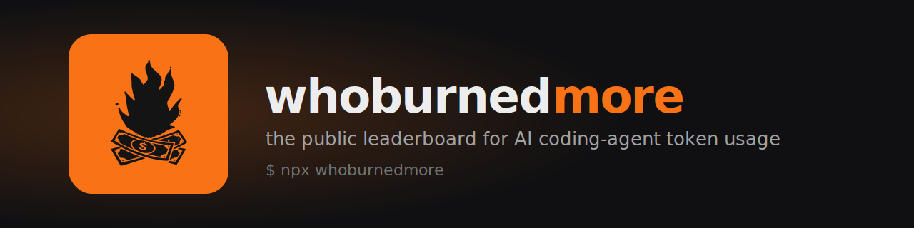

<div align="center">

<a href="https://whoburnedmore.com"></a>

### Know exactly how many tokens — and dollars — your AI coding agents burned.

**A local-first CLI that parses the session transcripts already on your disk and turns them into a token-and-cost report.** It streams your [Claude Code](https://claude.com/claude-code) and [OpenAI Codex](https://openai.com/codex) logs line by line, aggregates usage by model, project, agent, tool and day, prices it against a transparent table — and makes **zero network calls** doing it.

[](https://github.com/amiinwani/whoburnedmore.com/actions/workflows/ci.yml)
[](./LICENSE)
[](https://nodejs.org)
[](https://whoburnedmore.com)

</div>

## ▶ Get started in one command

No install, no sign-up — just run:

```sh
npx whoburnedmore
```

It reads only the numeric `usage` counters in your transcripts — never your prompts or code — so you get a full report in seconds. Then **land on the global leaderboard at [whoburnedmore.com](https://whoburnedmore.com)**, where developers around the world compare who's burned the most across Claude Code, Codex, Cursor and more.

> ### 🏆 Think you've burned the most?
>
> Run **`npx whoburnedmore`** and find out where you rank. Only your **daily token totals** are shared to the board — never your prompts or your code. Make your entry private or remove it anytime — or stay fully offline with the open-source edition below.

---

```text
  🔥 whoburnedmore — your local AI token burn report
  ────────────────────────────────────────────────

  1.82B tokens burned   $3,410.00 est.
  12,704 assistant messages · 18 active days · 2026-05-29 → 2026-06-15

  By model
    ████████░░░░░░░░░░ claude-opus-4-8               1.10B    $2,512.40
    █████░░░░░░░░░░░░░ claude-sonnet-4-6           512.00M      $640.10
    ██░░░░░░░░░░░░░░░░ claude-haiku-4-5            210.00M       $36.20

  By project
    ███████░░░░░░░░░░░ api                          903.00M    $1,640.00
    ████░░░░░░░░░░░░░░ web-app                      540.00M      $980.00
    ██░░░░░░░░░░░░░░░░ infra                        377.00M      $790.00

  Prompt cache   97.4% read-hit rate (1.71B cached reads)

  ────────────────────────────────────────────────
  100% local · nothing left your machine.
  Compare on the public board → https://whoburnedmore.com
```

## ✨ Features

- **🔒 Local-first, provably.** The open-source edition reads the transcripts already on your disk and makes **zero** network requests — no telemetry, no account, no API keys. This isn't a promise: a committed [zero-network test](./test/zero-network.test.ts) greps **both the TypeScript source and the built `dist/` bundle** for `fetch`, raw sockets (`node:net`/`tls`/`dgram`), `WebSocket` and any `http(s)://` literal on every CI run, so a regression that phones home fails the build.
- **🤖 Multi-agent.** Counts both **Claude Code** and **OpenAI Codex** usage, folded into one report with a **by-agent** breakdown. Filter to one with `--agent`.
- **💸 Real cost estimates.** Turns raw token counts into dollar figures using a transparent, editable [pricing table](./src/pricing.ts) — labelled with the month the prices were last reviewed.
- **🧩 Breakdowns that matter.** See your burn split **by model**, **by project**, **by agent**, and **by tool** (with per-tool call counts and error rates), so you know exactly where the tokens went.
- **📈 Trend & burn rate.** `--by-day` draws a per-day sparkline of tokens and cost plus your average tokens/day and $/day.
- **🧑‍💻 Honest per-message stats.** Counts your *real typed messages* (not tool results or injected prompts) and reports avg tokens and cost per message, plus how much your subagents burned.
- **⚡ Prompt-cache insight.** Surfaces your cache read-hit rate — the single biggest lever on what you actually pay.
- **🖼️ Beautiful HTML dashboard.** `--html` writes a self-contained, offline dashboard you can open in any browser or share.
- **🪶 Tiny & dependency-free at runtime.** Strict TypeScript compiled to a single esbuild bundle (`dist/cli.js`) with **zero runtime dependencies** — the only third-party code is dev-time build/test tooling. Built on Node's standard library, it runs on any **Node ≥ 20**. Nothing to trust but the code you can read here.

## 🧑‍💻 Run from source — the open-source local edition

The quickest way in is `npx whoburnedmore` above. **This repository is the open-source, 100% local edition**: it produces the same burn report but runs entirely offline and uploads nothing — perfect if you want to read every line before you run it, or stay off the leaderboard.

You'll need **[Node.js](https://nodejs.org) 20+** and some [Claude Code](https://claude.com/claude-code) usage on this machine.

### Run this edition straight from GitHub

```bash
npx github:amiinwani/whoburnedmore.com
```

### Or clone and run

```bash
git clone https://github.com/amiinwani/whoburnedmore.com.git
cd whoburnedmore.com
npm install        # also builds the CLI
npm start          # == node dist/cli.js
```

## 📖 Usage

```bash
whoburnedmore                  # print your burn report
whoburnedmore --by-day         # per-day trend (sparkline) + burn rate
whoburnedmore --html           # also write ./whoburnedmore.html
whoburnedmore --html out.html  # ...to a custom path
whoburnedmore --since 30       # only count the last 30 days
whoburnedmore --dir <path>     # read Claude transcripts from a custom directory
whoburnedmore --agent codex    # only count one agent: claude-code | codex
whoburnedmore --json           # raw aggregated JSON (pipe it anywhere)
whoburnedmore --version        # (-v)
whoburnedmore --help           # (-h)
```

| Flag | What it does |
| --- | --- |
| `--by-day` | Show a compact per-day token/cost trend (sparkline) and your average burn rate. |
| `--html [file]` | Write a self-contained HTML dashboard (default `./whoburnedmore.html`). |
| `--since <days>` | Only include usage from the last *N* days (must be a positive number). |
| `--dir <path>` | Point at a custom Claude transcripts directory instead of `~/.claude/projects`. |
| `--agent <name>` | Limit the report to one agent: `claude-code` or `codex`. |
| `--json` | Print the aggregated data as JSON instead of the report. |
| `--version` / `-v`, `--help` / `-h` | Print the version / help. |

Unknown flags and a bad `--since` (non-numeric, zero, or negative) now print an error and exit non-zero rather than being silently ignored.

> **Day bucketing is UTC.** The `--by-day` view and the `byDay` series in `--json` group usage by UTC calendar day, so a late-night session may land on the next day depending on your timezone.

## 🔍 How it works

Claude Code stores one [JSON Lines](https://jsonlines.org) transcript per session under:

```
~/.claude/projects/<project>/<session-id>.jsonl
```

Every assistant turn in those files carries a `usage` block — input tokens, output tokens, and the prompt-cache read/write counts — plus the model name and a timestamp.

The parser ([`src/scan.ts`](./src/scan.ts)) is a **streaming line reader**: it opens each file with `createReadStream` and walks it through `node:readline`, so a single line — not the whole transcript — is ever held in memory, and it folds each turn straight into per-key accumulators (`Map`s keyed by model, project, agent, tool and UTC day). Footgun-proofing is built in: it **skips files over 64 MB and caps the scan at 5,000 files** so a pathological transcript store can never hang or OOM the CLI, and a malformed JSON line is skipped rather than fatal. The result is a single `Report` object the renderers turn into the terminal view, `--html` dashboard, or `--json`. The code is small on purpose — start with `scan.ts`.

It does the same for **OpenAI Codex** rollouts under `~/.codex/sessions` (when present): it pulls `cwd` + `model` from the session-meta / turn-context records, reads each turn's `token_count` record, maps cached input onto cache reads and reasoning onto output, and tags every entry with its `agent` so the report can break usage down per agent. Sidechain (subagent) turns are accounted separately, and only *real human-typed* user turns form the denominator for per-message averages. If you only use one agent, the other's directory is simply absent and ignored.

### Architecture at a glance

A deliberately flat pipeline — read → aggregate → render — with one module per stage and no shared mutable state between them:

| Module | Responsibility |
| --- | --- |
| [`src/scan.ts`](./src/scan.ts) | Streaming transcript reader + aggregator. Walks Claude Code & Codex `*.jsonl` line by line and folds usage into the per-key `Map`s of a single `Report`. |
| [`src/pricing.ts`](./src/pricing.ts) | Public per-model price table (USD per 1M tokens), tagged with the month it was last reviewed. `estimateCost()` is the only thing that turns tokens into dollars. |
| [`src/report.ts`](./src/report.ts) | Renders a `Report` as the colourful terminal view. Dependency-free ANSI styling that auto-disables on non-TTY / `NO_COLOR`. |
| [`src/html.ts`](./src/html.ts) | Renders the same `Report` as one self-contained HTML file — inline CSS, no external fonts/scripts/trackers, zero network requests. |
| [`src/format.ts`](./src/format.ts) | Pure formatting helpers (token/USD humanizing, bars, sparklines) shared by both renderers. |
| [`src/cli.ts`](./src/cli.ts) | Arg parsing, flag validation, and wiring the stages together. |

Every renderer consumes the same immutable `Report`, so a new output format is just another pure function of that object. The build (`scripts/build.mjs`) bundles it all to a single `dist/cli.js` with esbuild.

## 🛡️ Privacy

You choose how you run it:

- **`npx whoburnedmore`** (the hosted product) shows your burn **and** adds you to the public leaderboard. Only your **daily token totals** are uploaded — never your prompts, your code, or any file contents — and you can make your entry private or delete it whenever you like.
- **This open-source edition** (run from source, above) is **100% local**: it makes zero network requests, has no telemetry, and nothing ever leaves your machine. It only reads files (never writes), and it parses only the numeric `usage` counters and the model name — never the content of your prompts or code.

Want to verify the open-source edition? It's a few hundred lines — read [`src/`](./src), or run it with `--json` and inspect exactly what it computes.

### What's local-only — and what is **not** in this tool

This edition is deliberately small and offline. To be precise about the boundary:

**What it does (all 100% local):**

- Reads `*.jsonl` transcript files under `~/.claude/projects` and `~/.codex/sessions` (or a `--dir` you pass).
- Parses only the **numeric `usage` counters**, the **model name**, the **tool names**, and the **project directory's name** — never the content of your prompts, your code, file contents, or file paths beyond a project folder's basename.
- Adds the numbers up and prints a report (and, with `--html`, writes one local file).

**What it deliberately does NOT do:**

- **No network, ever** — no `fetch`, no sockets, no DNS, no telemetry, no "phone home". Enforced by a committed [zero-network test](./test/zero-network.test.ts) that scans both the source and the built bundle.
- **No account, no login, no API keys, no secrets.**
- **No upload, no submit, no leaderboard** — this edition never sends anything anywhere. (The hosted `npx whoburnedmore` product is what shares daily totals to the board; that backend is not in this repo.)
- **No background scheduler or auto-sync** — it runs once when you run it.
- **No runtime dependencies** — the only third-party code is dev-time build/test tooling.

## 🌐 The hosted leaderboard

**[whoburnedmore.com](https://whoburnedmore.com)** is a public leaderboard where developers compare how much they've burned across Claude Code, Codex, Cursor and more. Run **`npx whoburnedmore`** to claim your spot. The website is a separate, hosted product — **this repository contains only the open-source local tool** and none of its backend.

## 🤝 Contributing

Issues and PRs welcome — see [CONTRIBUTING.md](./CONTRIBUTING.md). Good first contributions: add models to the [pricing table](./src/pricing.ts), support more agents' transcript formats, or improve the dashboard.

```bash
npm install        # install + build
npm test           # run the unit tests
npm run typecheck  # strict type check
npm run build      # bundle to dist/cli.js
```

## 📄 License

The **code** is [MIT](./LICENSE) © 2026 whoburnedmore — use it, fork it, build on it.

The whoburnedmore **name, logo, and brand assets** (everything in [`assets/`](./assets)) are trademarks of whoburnedmore and are **not** covered by the MIT license. Please don't use them in a way that implies endorsement by or affiliation with whoburnedmore.

<div align="center">
<br>
<a href="https://whoburnedmore.com"></a>
<br><br>
<strong>whoburnedmore</strong> &nbsp;·&nbsp; <a href="https://whoburnedmore.com">whoburnedmore.com</a>
</div>
